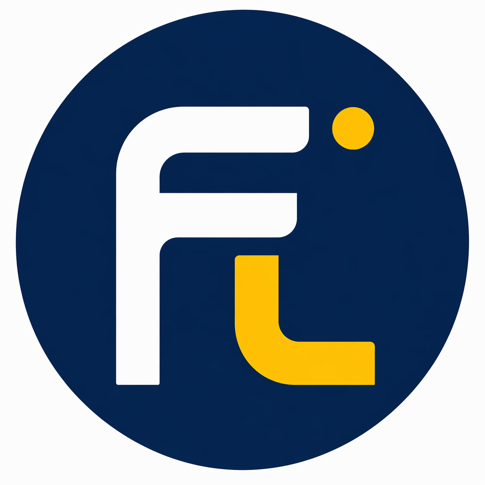

<p align="center">
  
</p>

<h1 align="center">InnerMirror Landing</h1>

<p align="center">
  Public PBL Learning Entry and Presentation Layer for the InnerMirror + Fribot ecosystem.
</p>

---

## Purpose

This repository is the official public application of the Fribot ecosystem.

The Landing provides the learner experience by:

- starting GitHub-based learning
- managing Project workflows
- collecting learner Reflection
- capturing GitHub Snapshots
- communicating with the private Runtime
- presenting Runtime intelligence
- visualizing project progress

The Landing presents learning.

The Runtime interprets learning.

---

## Architecture Boundary

```text
Learner

↓

GitHub Learning Entry

↓

Repository Selection

↓

Project

↓

Reflection

↓

Reflect + GitHub Analyze

↓

Runtime API

↓

Private Runtime

↓

Structured Runtime Response

↓

Landing Presentation
```

The Landing owns the learner experience.

The Runtime owns learning intelligence.

---

## Repository Identity

The Landing owns:

- GitHub Learning Entry
- GitHub Connection
- Repository Selection
- Project Creation
- Project Summary
- Reflection Input
- Reflection Editor
- Manual GitHub Snapshot Capture
- Runtime API Adapter
- Runtime Response Mapping
- UI State Management
- Progress Visualization
- Portfolio Presentation
- Coaching Presentation
- Decision Review Presentation

The Landing does **not** own:

- Reflection Analysis
- GitHub Interpretation
- Runtime Context
- Runtime Contract Interpretation
- Runtime Summary Generation
- Runtime Question Generation
- Runtime Coaching Generation
- Decision Review Generation
- Continuity Intelligence
- Runtime Memory
- Runtime Orchestration
- Proprietary AI reasoning

Runtime intelligence belongs exclusively to:

```text
innermirror-runtime-private
```

---

## Landing Architecture

The Landing follows the architecture below.

```text
GitHub Learning Entry

↓

Project

↓

Reflection

↓

GitHub Snapshot

↓

Runtime API Adapter

↓

Runtime Response Mapping

↓

Presentation Components

↓

Learner Experience
```

The Landing captures learning context.

The Runtime interprets learning context.

---

## Manual GitHub Snapshot

The MVP intentionally avoids continuous GitHub synchronization.

GitHub data is collected only when the learner explicitly requests analysis.

Official workflow:

```text
Reflect + GitHub Analyze

↓

Capture GitHub Snapshot

↓

Runtime
```

The MVP intentionally excludes:

- GitHub Webhook
- Scheduler
- Polling
- Background synchronization

This keeps the learner in complete control of when project context is analyzed.

---

## Repository Visibility Policy

The MVP intentionally analyzes **public GitHub repositories only**.

Private repositories are intentionally excluded from:

- repository discovery
- repository selection
- GitHub Snapshot generation
- Runtime project analysis

Repository visibility policy:

```text
Public Repository

↓

Repository Selection

↓

GitHub Snapshot

↓

Runtime Analysis
```

Private repositories are never returned to the Landing.

This policy:

- protects private source code,
- minimizes requested GitHub permissions,
- reduces unnecessary repository access,
- keeps the learning workflow transparent.

Future versions may introduce optional private repository support.

The MVP intentionally focuses on public software projects to provide
transparent learning, minimal permissions, and clear repository ownership.

---

## Runtime GitHub Session Recovery

GitHub authentication and Runtime authorization are separate states.

A learner may remain signed in to GitHub while the temporary Runtime
GitHub session has expired.

When this occurs:

- GitHub identity remains connected,
- repository access is suspended,
- verified organization repositories are cleared,
- the learner may reconnect the Runtime session without immediately
  revoking the entire GitHub authorization.

If the GitHub provider token is no longer available, the learner must
renew GitHub authorization.

---

## PBL Project Model

The Landing organizes learning around Projects.

Official hierarchy:

```text
Project

↓

Milestone

↓

Pull Request

↓

Reflection
```

Reflection is no longer treated as an isolated record.

Reflection belongs to a Project.

---

## Runtime Relationship

The Landing prepares Runtime Contract V2 inputs.

Current Runtime Context includes:

- Reflection
- Project Context
- Repository Context
- GitHub Snapshot
- Learning Context

The Landing submits this context to the private Runtime.

The Runtime returns:

- Summary
- Question
- Coaching
- Decision Review

Landing never generates these outputs locally.

---

## Architecture Governance

The Landing follows strict architectural governance.

Core principles:

- Landing owns presentation.
- Runtime owns intelligence.
- Learning Platform owns education.
- GitHub communication belongs to the Landing.
- GitHub interpretation belongs to the Runtime.
- Runtime reasoning must never exist inside the Landing.
- Presentation must remain independent from Runtime implementation.

These principles preserve long-term architectural consistency.

---

## Architecture Documents

Detailed documentation is available under:

```text
docs/architecture/

README.md

REPOSITORY_BOUNDARY.md

LANDING_RESPONSIBILITY_AUDIT.md

LANDING_RESPONSIBILITY_MATRIX.md

PBL_PROJECT_DOMAIN_MODEL.md

GITHUB_SNAPSHOT_INTEGRATION.md

ARCHITECTURE_GOVERNANCE.md
```

Developers should review these documents before introducing new Landing functionality.

---

## Current Status

Current Phase

```text
Phase 1

✓ GitHub Learning Entry

↓

✓ Repository Selection

↓

✓ Project Domain

↓

✓ Manual GitHub Snapshot

↓

Runtime Contract V2 Ready
```

Next Phase

```text
Phase 2

Landing

↓

Runtime Contract V2

↓

Runtime V2 Pipeline

↓

Project-based Runtime Intelligence
```

---

## Foundation Principle

The Learning Platform provides education.

The Landing provides project-based learning experiences.

The Runtime provides learning intelligence.

GitHub provides public development evidence.

Projects provide learning structure.

Reflection provides learner thinking.

Together they create one coherent Project-Based Learning experience.

---

## Production Deployment

The InnerMirror Landing application is built with Vite.

### Local Verification

```bash
npm install
npm run dev
npm run build
npm run preview
```

### Build Configuration

```text
Build Command: npm run build
Output Directory: dist
```

### Environment Variables

The current Landing application uses:

```text
VITE_RUNTIME_API_URL
VITE_RUNTIME_REQUEST_TIMEOUT_MS
VITE_RUNTIME_RETRY_COUNT
```

Local values should be stored in:

```text
.env.local
```

Public variable names and example values are documented in:

```text
.env.example
```

Variables prefixed with `VITE_` are included in the client-side application
bundle and must not contain private credentials or server-only secrets.

### Deployment Target

The current production deployment target is Vercel.

GitHub OAuth, Supabase authentication, and authenticated Reflection
persistence will be configured in separate Pull Requests after the public
Landing URL has been established.

```text
Supabase Foundation

↓

Environment

↓

Client

↓

Authentication
```

The learner always decides **when** analysis starts.

The platform defines **which repositories** are eligible for analysis.

The Runtime determines **how** learning context is interpreted.